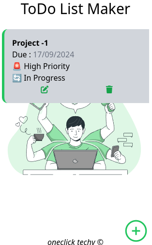

# 📝 To-Do List Web App

A simple, intuitive, and responsive To-Do list web app designed to help you stay organized and manage your daily tasks with ease.

## 🌟 Features

- ✨ **Add Tasks:** Quickly add tasks to stay on top of your to-do list.
- 🖊️ **Edit Tasks:** Easily edit tasks to update your plans.
- ❌ **Delete Tasks:** Remove completed or unnecessary tasks.
- 🕑 **Task Scheduling:** Set deadlines for tasks with a dynamic date picker.
- 📱 **Fully Responsive:** Works perfectly across all devices (desktop, tablet, mobile).
- 🎨 **Minimalistic UI:** Clean and user-friendly interface with a modern design.

## 🚀 Demo

You can try the app live here: [Live Demo](https://oneclicktechy.github.io/toDo-webApp/)

## 📷 Screenshots



## 🛠️ Technologies Used

- **Frontend:** HTML, CSS, Tailwind CSS, JavaScript
- **Version Control:** Git, GitHub

## ⚙️ How to Run

1. Clone the repository:

   ```bash
   git clone https://github.com/OneClickTechy/toDo-webApp.git
   ```

2. Open `index.html` in your browser.

## 🤝 Contributing

Contributions are welcome! Feel free to open an issue or submit a pull request.

## 🙌 Support

If you like this project, consider supporting me on [Buy Me a Coffee](https://buymeacoffee.com/oneclicktechy) ☕.

## 📧 Contact

For any questions or feedback, reach out to me at [oneclicktechy@gmail.com](mailto:oneclicktechy@gmail.com).

---

Made with 💻 by [OneClickTechy](https://github.com/OneClickTechy)
